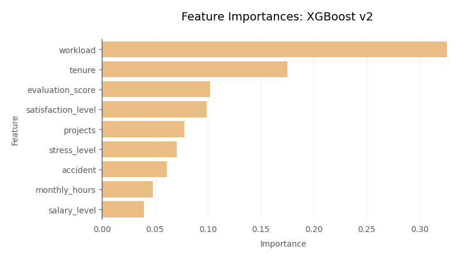

# Explaining and Predicting Employee Attrition: A Salifort Motors Case Study

[Google Advanced Data Analytics](https://www.coursera.org/professional-certificates/google-advanced-data-analytics) Capstone Project by [Markku Laine](https://markkulaine.com) (2023)

## Overview

*Salifort Motors* (a fictional company) is currently experiencing a high turnover of employees, suggesting that a large proportion of its employees may be dissatisfied with their jobs. The goal of this project is to help the company to increase employee retention by conducting an in-depth analysis of the employee survey data and building different machine learning models&mdash;`Decision Tree`, `Random Forest`, `XGBoost`&mdash;to predict employee attrition.


## Dataset

This project uses an [HR dataset](https://www.kaggle.com/datasets/mfaisalqureshi/hr-analytics-and-job-prediction) from Kaggle. The dataset contains 14,999 rows and 10 columns, each row representing self-reported information from employees.


## Results

- The analysis identified *high workloads*, *limited career advancement opportunities*, and *burnout among high performers* as the three main factors behind employees leaving the company.
- In the model comparison, `XGBoost v2` outperformed others, achieving an excellent **recall** rate of **93.5%** on the test data in identifying leaving employees.
- *workload* (engineered), *tenure*, *evaluation_score*, and *satisfaction_level* were the four most important features for the model. Surprisingly, *promoted* and *overtime* (engineered) were consistently among the least important features for all models.



The performance of the `XGBoost v2` model could be potentially improved by (1) collecting more data, such as office location in future surveys and (2) optimizing the model’s decision threshold to attain the highest possible *recall* score.

## Conclusion

Salifort Motors faces a significant employee turnover challenge, with an attrition rate of 16.6%. The analysis identified three main factors contributing to this trend: *high workloads*, *limited career advancement opportunities*, and *burnout among high performers*.

To address these concerns, we recommend a comprehensive strategy that includes:

- **Workload balancing:** Distribute projects equitably to reduce excessive workloads.
- **Promotion strategies:** Implement structured promotion plans to identify and support high performers.
- **Well-being initiatives:** Foster a culture of employee well-being and appreciation through flexible work arrangements, stress management programs, and meaningful recognition.
- **Proactive attrition mitigation:** Deploy the `XGBoost v2` model, which achieved an outstanding *recall* score of 0.9347, to identify employees at risk of leaving and implement preventative measures.

By implementing these recommendations, Salifort Motors can effectively combat employee turnover, enhance employee satisfaction, and cultivate a thriving workforce.


## More Information

- Project Proposal [[PDF](./docs/project_proposal.pdf)] [[DOC](./docs/project_proposal.docx)]
- Executive Summary [[PDF](./docs/executive_summary.pdf)] [[PPT](./docs/executive_summary.pptx)]
- Jupyter Notebook [[PDF](./docs/employee_retention_project.pdf)] [[JNB](./employee_retention_project.ipynb)]
- HR Dataset [[CSV](./datasets/hr_dataset.csv)]
- Models [[directory](./models/)]


## Quick Start Guide

### Installation

#### Prerequisites

* [Python 3.10+](https://www.python.org/)

#### Virtual Environment

Install [Miniconda](https://docs.conda.io/en/latest/miniconda.html), after which we can create a dedicated Python virtual environment for the project:

```bash
# Create a virtual environment for Python 3.10
conda create -n gada-capstone-project python=3.10

# Activate the environment
conda activate gada-capstone-project

# Deactivate the environment, if needed
conda deactivate
```

#### Python Dependencies

Install Python dependencies, including those needed for development:

```bash
pip install -r requirements-dev.txt
```

> **Note:** Make sure the Python virtual environment is active before installing requirements.


### Usage

Open the Jupyter notebook:

```bash
jupyter notebook employee_retention_project.ipynb
```


#### Utility tools

This project comes with [pre-commit](https://pypi.org/project/pre-commit/) hooks that include several utility tools to ensure a consistent and high-quality coding style. To install and use (or uninstall) `pre-commit`, run:

```bash
# Install pre-commit into your git hooks
pre-commit install --install-hooks --overwrite

# Run all pre-commit hooks against all tracked files
pre-commit run -a

# Run all pre-commit hooks against all files
pre-commit run --files **/*.py

# Uninstall pre-commit from your git hooks, if needed
pre-commit uninstall
```


## License

Copyright (c) 2023 [Markku Laine](https://markkulaine.com)

This software is distributed under the terms of the [MIT License](https://opensource.org/license/mit/). See [LICENSE](./LICENSE) for details.
